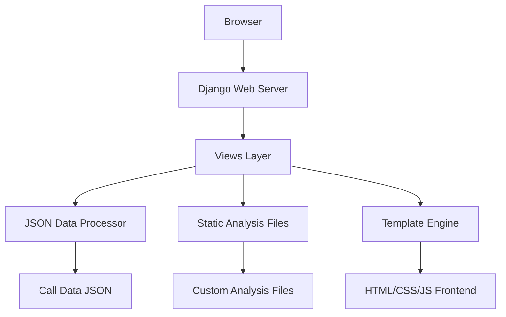

# Design Document

## Overview

The Service Call Analyzer is a Django web application that provides a comprehensive interface for reviewing service call transcripts alongside compliance analysis. The application features a single-page layout with a two-column design: transcript navigation on the left and analysis display on the right. The system processes JSON data files containing call transcripts, compliance scores, and metadata to create an interactive analysis dashboard.

## Architecture

### System Architecture



### Application Structure

- **Django Project**: `service_call_analyzer`
- **Django App**: `call_analysis`
- **Static Files**: CSS, JavaScript, custom analysis files
- **Templates**: Single-page application template
- **Data**: JSON files containing call transcripts and compliance data

## Components and Interfaces

### 1. Data Models

#### CallData Class
```python
class CallData:
    def __init__(self, json_data):
        self.meta = json_data.get('meta', {})
        self.compliance_check = json_data.get('compliance_check', [])
        self.utterances = json_data.get('utterances', [])
        self.segments = json_data.get('segments', [])
        
    def get_stages(self):
        # Returns unique stages from compliance_check
        
    def get_utterances_by_stage(self, stage):
        # Returns utterances filtered by stage
        
    def get_compliance_data(self, stage):
        # Returns compliance score, evidence, suggestions for stage
```

#### CustomAnalysis Class
```python
class CustomAnalysis:
    def __init__(self, analysis_file_path):
        self.analysis_data = self.load_analysis_file()
        
    def get_stage_analysis(self, stage):
        # Returns custom analysis for specific stage
```

### 2. Views Layer

#### MainAnalysisView
- **Purpose**: Serves the main analysis page
- **Data Processing**: Loads JSON call data and custom analysis
- **Template Context**: Provides structured data for frontend rendering

```python
class MainAnalysisView(TemplateView):
    template_name = 'call_analysis/main.html'
    
    def get_context_data(self, **kwargs):
        context = super().get_context_data(**kwargs)
        
        # Load call data
        call_data = self.load_call_data()
        
        # Load custom analysis
        custom_analysis = self.load_custom_analysis()
        
        # Structure data for template
        context.update({
            'call_meta': call_data.meta,
            'stages': call_data.get_stages(),
            'utterances_by_stage': self.group_utterances_by_stage(call_data),
            'compliance_data': call_data.compliance_check,
            'custom_analysis': custom_analysis.analysis_data
        })
        
        return context
```

### 3. Frontend Components

#### Navigation Component
- **Location**: Left sidebar
- **Functionality**: Stage-based navigation with smooth scrolling
- **Features**: 
  - Clickable stage links
  - Active section highlighting
  - Progress indicator

#### Transcript Display Component
- **Location**: Left main content area
- **Functionality**: Displays grouped utterances by stage
- **Features**:
  - Speaker color coding (Tech: green, Customer: blue)
  - Timestamp display
  - Line number references
  - Stage section headers

#### Analysis Panel Component
- **Location**: Right sidebar
- **Functionality**: Shows compliance and custom analysis
- **Features**:
  - Compliance scores with visual indicators
  - Evidence excerpts
  - Improvement suggestions
  - Custom analysis insights

## Data Models

### JSON Data Structure

#### Input Data Format
```json
{
  "meta": {
    "call_type": "string",
    "date_analyzed": "date",
    "transcribed_with": "string"
  },
  "compliance_check": [
    {
      "stage": "string",
      "score": "number",
      "max": "number", 
      "evidence": "string",
      "suggestion": "string"
    }
  ],
  "utterances": [
    {
      "speaker": "string",
      "start": "number",
      "end": "number", 
      "text": "string",
      "stage": "string"
    }
  ]
}
```

#### Custom Analysis Format
```json
{
  "stages": {
    "Introduction": {
      "analysis": "Custom analysis text",
      "key_points": ["point1", "point2"],
      "recommendations": ["rec1", "rec2"]
    },
    "Problem Diagnosis": {
      "analysis": "Custom analysis text",
      "key_points": ["point1", "point2"],
      "recommendations": ["rec1", "rec2"]
    }
  }
}
```

## Error Handling

### Data Loading Errors
- **JSON Parse Errors**: Display user-friendly error message
- **Missing Files**: Graceful degradation with placeholder content
- **Malformed Data**: Validation with specific error reporting

### Frontend Error Handling
- **Navigation Failures**: Fallback to manual scrolling
- **Missing Analysis Data**: Display "No analysis available" message
- **Responsive Layout Issues**: CSS fallbacks for different screen sizes

## Testing Strategy

### Unit Tests
- **Data Processing**: Test JSON parsing and data structure validation
- **View Logic**: Test context data preparation and template rendering
- **Custom Analysis Loading**: Test static file processing

### Integration Tests
- **End-to-End Navigation**: Test smooth scrolling and section highlighting
- **Data Display**: Verify correct utterance grouping and analysis display
- **Responsive Design**: Test layout on different screen sizes

### Manual Testing
- **User Experience**: Navigation flow and visual appeal
- **Performance**: Page load times with large transcript files
- **Browser Compatibility**: Cross-browser testing for CSS and JavaScript features

## Technology Stack

### Backend
- **Framework**: Django 4.2+
- **Python**: 3.8+
- **Data Processing**: Built-in JSON library
- **Static Files**: Django static files handling

### Frontend
- **CSS Framework**: Bootstrap 5 for responsive design
- **JavaScript**: Vanilla JS for navigation and smooth scrolling
- **Icons**: Bootstrap Icons or Font Awesome
- **Animations**: CSS transitions and transforms

### Development Tools
- **Package Management**: pip with requirements.txt
- **Static Files**: Django collectstatic for production
- **Development Server**: Django runserver for local development

## Deployment Considerations

### Static Files Configuration
- **CSS/JS**: Minification for production
- **Custom Analysis Files**: Version control and easy editing access
- **Media Files**: JSON data file management

### Performance Optimization
- **Large Transcripts**: Pagination or lazy loading for very long calls
- **Caching**: Template fragment caching for repeated analysis data
- **Compression**: Gzip compression for JSON and static files